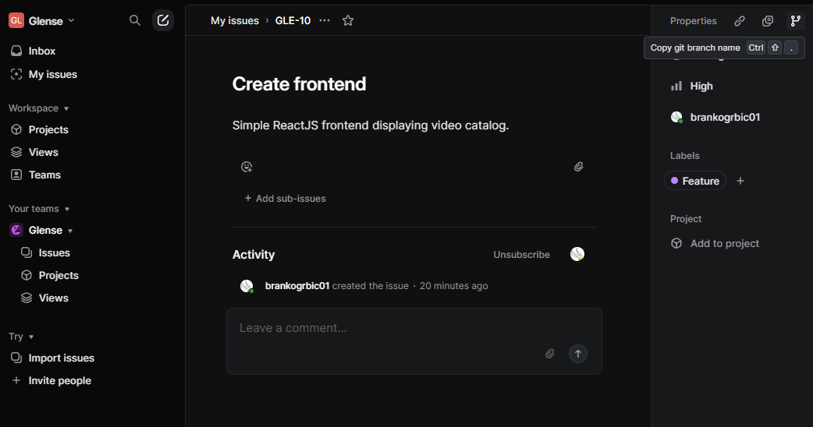

# Mikroservisi koji treba da se urade

1. Account
2. Video katalozi / streaming
3. Donations
4. Live chat
5. Recommendation Engine

### Account
Profili, mogu medjusobno da se prate, sistem notifikacije, login/registracija

### Video katalozi / live streaming

Upload videa, start live streaming-a, mogucnost kreiranja plejlisti. Subscription deo gde se vide klipovi subscribe-ovanih profila

### Donacije

Donacije izmedju naloga i donacije kreatorima sajta (potencijalno neka porukica uz donaciju?)

### Live chat

u toku live streaminga profili mogu da se dopisuju sa strimerom ali i drugima. Strimer moze da ima neke permisije da blokira naloge itd

### Recommendation Engine
AI recommendation koji bi pravio analitiku i iz te analitike bi za svakog usera posebno imao personalizovani main feed

# Instrukcije za instalaciju

`Visual Studio 2022 / Visual studio code` je preporuka

Instalirati dodatne stvari: 
- `.NET8`
- `nodejs v22`
- SQL Server 

# Instrukcije za rad

1. Koristimo [Linear](https://linear.app/glense/team/GLE/active) za tracking. Pogledajte [backlog](https://linear.app/glense/team/GLE/backlog) npr. setupujte github s linear-om vrv. olaksava posao.
2. Kada hocete da napravite granu, <b> prvo napravite issue </b> na Linear-u. 

Kopirajte ime grane i ukucajte u terminalu: <br>
`git checkout -b ime_grane`
3. Kada zavrsite sa radom na feature-u <b>napravite PR</b>. To mozete odraditi sa github sajta a moze i preko terminala. Push na master granu je zabranjen sam po sebi, tj. treba vam _jedan approve_ za merge u master.

# Kako pokrenuti bazu (VS Code)

1. Instalirati SQL server (mssql) ekstenziju
2. Pokrenuti `glense.sql` (mozes preko ekstenzije)
3. Napraviti konekciju s bazom
    - `ctrl+alt+D` -> Add connection -> Podesi parametre
    - Profile name: **Glense**
    - Server name: **TVOJE_IME\SQLEXPRESS** *(Windows)* / **localhost,1443** *(Linux)*
    - Trust server certificate - **yes**
    - Authentication type: **Windows authentication** *Windows* / **SQL Server Authentification** *(Linux)*
    - Database name: **Glense**

*Note:* 
Obavezno namestiti vas `Glense.Server/.env` fajl radi setup-ovanja baze unutar naseg servera
Postoji `Glense.Server/.env_example` kako to mozete uraditi

## Šema baze


# Kako pokrenuti projekat
1. Preko konzole lociraj se na `Glense.Server/` folder
2. **dotnet run**

# Pre-commit Hook

When you first clone the repository, run the setup script to install the pre-commit hook:

```bash
# Make sure you're in the repository root
./scripts/setup-hooks.sh
```

This project includes a pre-commit hook that automatically formats C# code before each commit.

The hook will automatically run and format your C# code. If any files are modified by formatting, the commit will be blocked and you'll need to stage the formatted files and commit again.

You can also run formatting manually:

```bash
# Place yourself on some directory:
dotnet format Glense
```
