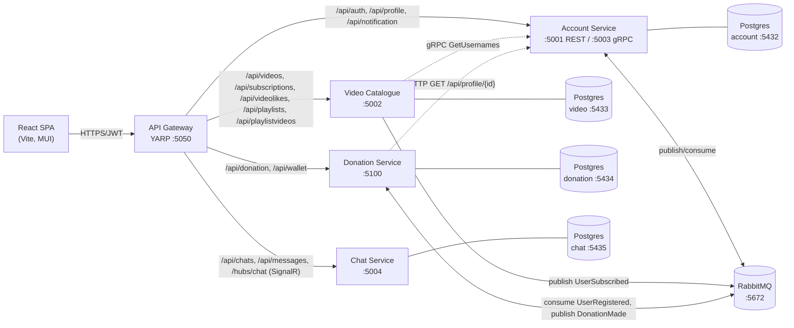
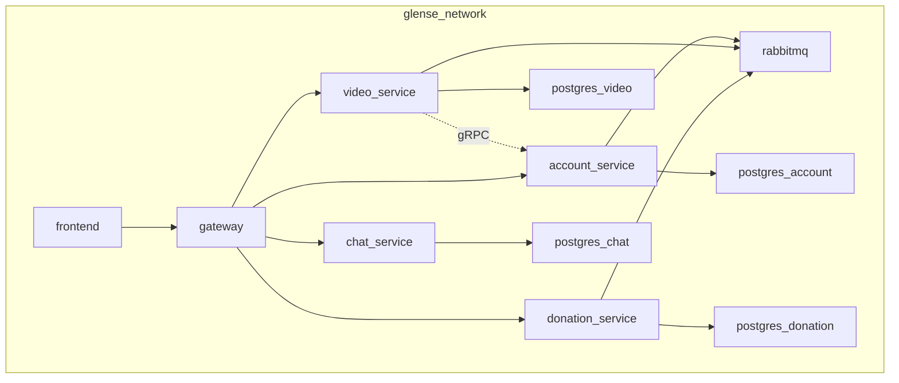

# Architecture

Glense is a microservice video-streaming platform: an API gateway in front of four backend services, each owning its own PostgreSQL database, plus a React SPA. Sync calls between services use HTTP/REST or gRPC; async events use RabbitMQ via MassTransit.

## System context

## Service responsibilities & data ownership

| Service | Owns | Public surface | Internal deps |
|---------|------|----------------|---------------|
| **Gateway** ([Glense.Server/Program.cs](../Glense.Server/Program.cs)) | YARP route table, CORS, gateway-level health | `/api/*`, `/hubs/chat`, `/health` | None |
| **Account** ([services/Glense.AccountService/](../services/Glense.AccountService)) | `users`, `notifications` (Postgres :5432) | Auth, profiles, notifications, gRPC `AccountGrpc` | RabbitMQ (consumes `DonationMadeEvent`, `UserSubscribedEvent`) |
| **Video Catalogue** ([services/Glense.VideoCatalogue/](../services/Glense.VideoCatalogue)) | `videos`, `comments`, `subscriptions`, `videolikes`, `playlists`, `playlistvideos` (Postgres :5433); video files on disk | Upload, list/search/stream, comments, playlists, subscriptions, likes | gRPC client → Account; RabbitMQ publish `UserSubscribedEvent` |
| **Donation** ([Glense.Server/DonationService/](../Glense.Server/DonationService)) | `wallets`, `donations` (Postgres :5434) | Wallet CRUD/topup/withdraw, donations | HTTP → Account profile validation; RabbitMQ consume `UserRegisteredEvent`, publish `DonationMadeEvent` |
| **Chat** ([services/Glense.ChatService/](../services/Glense.ChatService)) | `chats`, `messages` (Postgres :5435) | REST + SignalR hub `/hubs/chat` | None (JWT validated locally) |

## Inter-service communication

| Flow | Mechanism | Producer | Consumer | Why |
|------|-----------|----------|----------|-----|
| New user → wallet | RabbitMQ event `UserRegisteredEvent` | Account ([AuthService](../services/Glense.AccountService/Services)) | Donation ([UserRegisteredEventConsumer.cs](../Glense.Server/DonationService/Consumers/UserRegisteredEventConsumer.cs)) | Fire-and-forget, registration must not block on Donation availability |
| Donation made → notify recipient | RabbitMQ event `DonationMadeEvent` | Donation ([DonationController.cs](../Glense.Server/DonationService/Controllers/DonationController.cs)) | Account ([DonationMadeEventConsumer.cs](../services/Glense.AccountService/Consumers/DonationMadeEventConsumer.cs)) | Async — donation succeeds even if Account is briefly unavailable |
| Subscribe → notify channel owner | RabbitMQ event `UserSubscribedEvent` | Video ([SubscriptionsController.cs](../services/Glense.VideoCatalogue/Controllers/SubscriptionsController.cs)) | Account ([UserSubscribedEventConsumer.cs](../services/Glense.AccountService/Consumers/UserSubscribedEventConsumer.cs)) | Async |
| Donation pre-flight: validate recipient | HTTP `GET /api/profile/{userId}` | Donation ([AccountServiceClient](../Glense.Server/DonationService/Services)) | Account ([ProfileController.cs](../services/Glense.AccountService/Controllers/ProfileController.cs)) | Sync — must reject before debiting donor |
| Resolve uploader usernames | gRPC `AccountGrpc.GetUsernames` | Video ([AccountGrpcClient](../services/Glense.VideoCatalogue/GrpcClients)) | Account ([AccountGrpcService.cs](../services/Glense.AccountService/GrpcServices/AccountGrpcService.cs)) | Batch lookup, low latency, Protobuf-typed |

Contract: [services/Glense.AccountService/Protos/account.proto](../services/Glense.AccountService/Protos/account.proto) and event types in [services/Glense.AccountService/Messages/](../services/Glense.AccountService/Messages), [services/Glense.VideoCatalogue/Messages/](../services/Glense.VideoCatalogue/Messages), [Glense.Server/DonationService/Messages/](../Glense.Server/DonationService/Messages).

## Auth model

- **End-user auth**: JWT (HS256) issued by Account on register/login. Token validated locally by every service using the shared `JWT_SECRET_KEY`/`JWT_ISSUER`/`JWT_AUDIENCE`. Default lifetime: 7 days.
- **Service-to-service auth**: Shared `INTERNAL_API_KEY` injected on outbound HTTP/gRPC calls between services. The Account service's gRPC pipeline enforces it via [`InternalApiKeyInterceptor`](../services/Glense.AccountService/GrpcServices); the Video service attaches it via [`InternalApiKeyClientInterceptor`](../services/Glense.VideoCatalogue/GrpcClients).
- **CORS**: Each service restricts origins to a configurable allowlist (default: `localhost:5173`, `:50653`, `:50654`, `:3000`).

## Failure modes (designed-in)

| Scenario | Behavior |
|----------|----------|
| Donation unavailable on registration | User is still created; wallet is created later by `UserRegisteredEventConsumer` once RabbitMQ delivers the event. |
| Account unavailable when video listing | Video list returns; `uploaderUsername` is `null` (gRPC failure swallowed in the client). |
| Account unavailable when donating | Donation rejected with 400 (recipient validation is synchronous). |
| Account unavailable for donation/subscription notifications | Donation/subscription succeeds; the event sits in RabbitMQ until the Account consumer picks it up. |
| Postgres unavailable on startup | Each service falls back to EF Core in-memory if no connection string is configured (development convenience only). |

## Deployment topology (docker-compose)

Container images are built from each service's `Dockerfile`. Ports inside the network differ from host-published ports — see [SETUP.md](SETUP.md).

## Where to look next

- Setup & running: [SETUP.md](SETUP.md)
- All env vars: [CONFIGURATION.md](CONFIGURATION.md)
- API references: [api/](api/)
- End-to-end flows: [flows/](flows/)
- Testing: [TESTING.md](TESTING.md)
- Contributing: [CONTRIBUTING.md](CONTRIBUTING.md)
