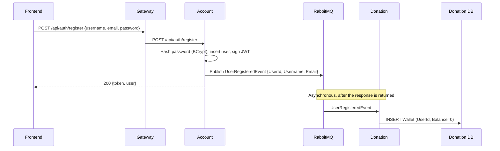
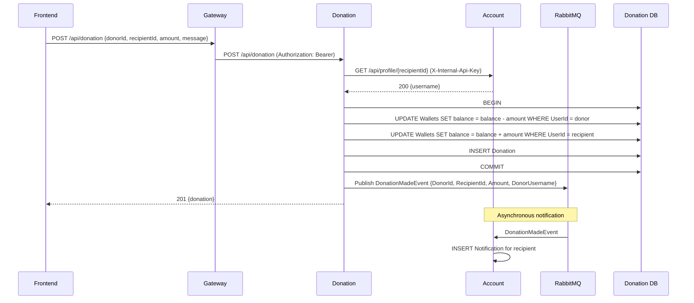
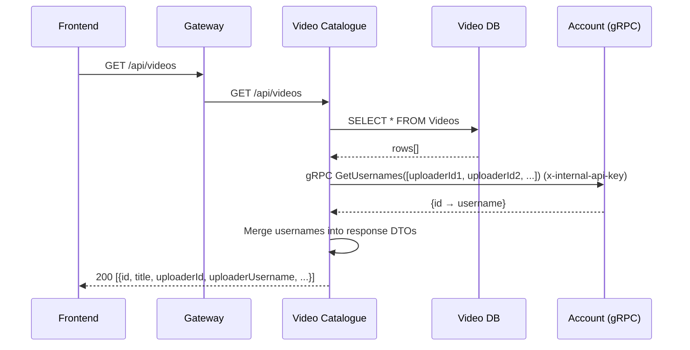
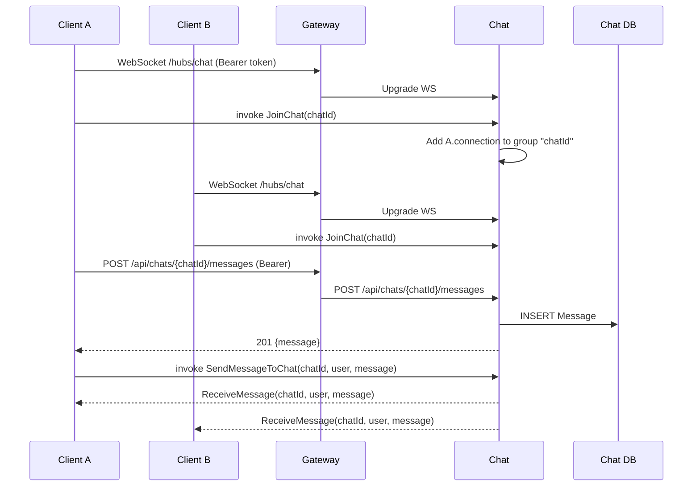

# End-to-End Flows

Sequence diagrams for the four critical end-to-end flows. Diagrams use Mermaid (rendered natively by GitHub).

## 1. Registration → wallet creation

The HTTP response returns as soon as the user is persisted. Wallet creation happens out-of-band and is retried by RabbitMQ if Donation is down.

## 2. Make a donation

Recipient validation is synchronous (HTTP) so a bad recipient returns `400` immediately. The "you received a donation" notification is asynchronous so a slow Account does not slow the payment response.

## 3. Video listing with username resolution

If the gRPC call fails, the listing still returns; `uploaderUsername` is `null` for affected rows.

## 4. Real-time chat

REST handles persistence; the SignalR hub handles fan-out. A typical client posts the message first, then triggers the broadcast.
