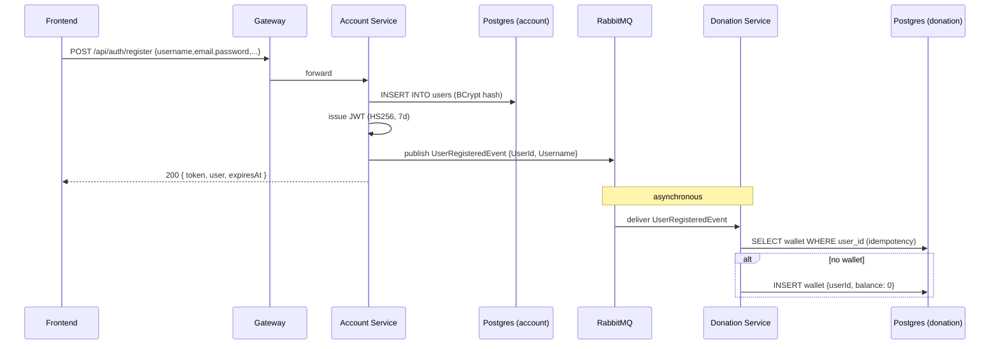

# Flow: Registration & wallet creation

## Trigger

Client `POST /api/auth/register` through the gateway.

## Sequence

## Code refs

- HTTP entry: `AuthController.Register` in [services/Glense.AccountService/Controllers/AuthController.cs](../../services/Glense.AccountService/Controllers/AuthController.cs)
- Hashing + token: `AuthService` in [services/Glense.AccountService/Services/](../../services/Glense.AccountService/Services)
- Event type: [services/Glense.AccountService/Messages/UserRegisteredEvent.cs](../../services/Glense.AccountService/Messages/UserRegisteredEvent.cs)
- Consumer: [Glense.Server/DonationService/Consumers/UserRegisteredEventConsumer.cs](../../Glense.Server/DonationService/Consumers/UserRegisteredEventConsumer.cs)

## Failure modes

| Failure | Behavior |
|---------|----------|
| RabbitMQ down at register-time | User is still created. The publish is best-effort; once RabbitMQ recovers, MassTransit retries on the next bus interaction. |
| Donation service down | Event sits in the queue; wallet is created when Donation comes back. |
| Duplicate event delivery | Consumer checks for existing wallet (idempotent). |
| Wallet insert race | `DbUpdateException` caught and logged; the other writer wins. |

## Related APIs

- [`POST /api/auth/register`](../api/account.md)
- [`GET /api/wallet/user/{userId}`](../api/donation.md)
