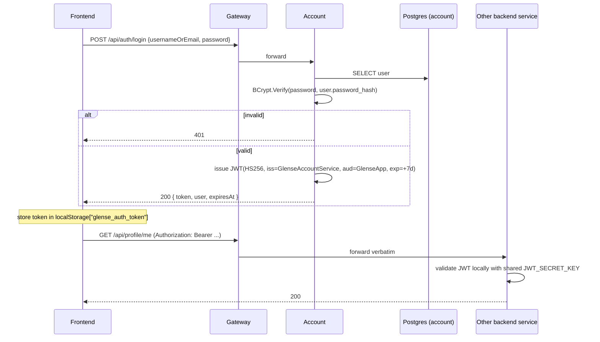

# Flow: Login & JWT propagation

## Trigger

Client `POST /api/auth/login`.

## Sequence

## Code refs

- Login: `AuthController.Login` in [services/Glense.AccountService/Controllers/AuthController.cs](../../services/Glense.AccountService/Controllers/AuthController.cs)
- Token validation parameters (every service): each `Program.cs` (Account, Video, Donation, Chat)
- Frontend axios interceptor: [glense.client/src/services/apiClient.js](../../glense.client/src/services/apiClient.js)
- Auth context (token lifecycle): [glense.client/src/context/AuthContext.jsx](../../glense.client/src/context/AuthContext.jsx)

## Token shape

| Claim | Source |
|-------|--------|
| `nameid` (`ClaimTypes.NameIdentifier`) | `users.id` (Guid) |
| `unique_name` / `name` | `users.username` |
| `email` | `users.email` |
| `iss`, `aud`, `exp` | `JWT_ISSUER`, `JWT_AUDIENCE`, +7 days |

## Failure modes

| Failure | Response |
|---------|----------|
| Wrong password | `401 { "message": "Invalid credentials" }` |
| Expired token on subsequent request | `401`. Frontend interceptor clears `glense_auth_token` and `glense_user`. |
| Service has wrong `JWT_SECRET_KEY` | All requests rejected with `401`. Confirm `.env` is consistent across services. |
