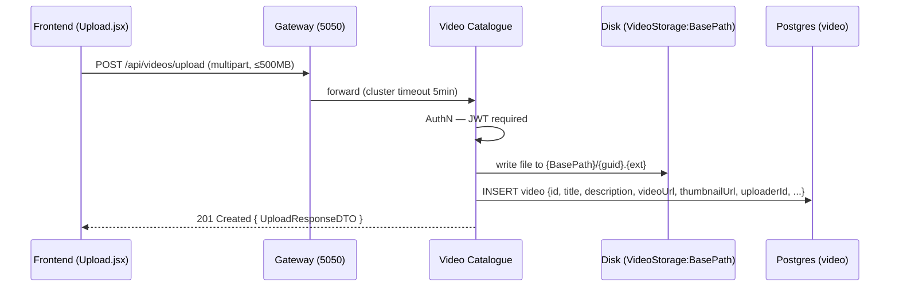
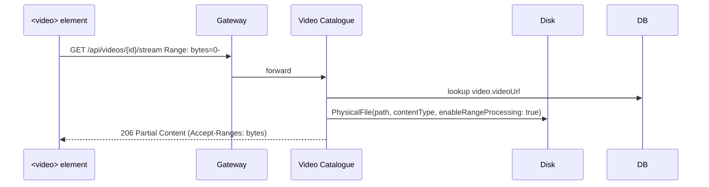

# Flow: Video upload & streaming

## Upload

## Stream

## Code refs

- Upload + stream: [services/Glense.VideoCatalogue/Controllers/VideosController.cs](../../services/Glense.VideoCatalogue/Controllers/VideosController.cs) (`Upload`, `Stream`, `Thumbnail`)
- Storage abstraction: `IVideoStorage` / `LocalFileVideoStorage` in [services/Glense.VideoCatalogue/Services/](../../services/Glense.VideoCatalogue/Services)
- Frontend: [glense.client/src/components/Upload.jsx](../../glense.client/src/components/Upload.jsx), [VideoStream.jsx](../../glense.client/src/components/VideoStream.jsx)
- 500 MB Kestrel cap: [services/Glense.VideoCatalogue/Program.cs](../../services/Glense.VideoCatalogue/Program.cs)

## Failure modes

| Failure | Behavior |
|---------|----------|
| File > 500 MB | Kestrel rejects with `413 Payload Too Large` before reaching the controller |
| Disk write fails | Service returns `500`; the half-written file is left for cleanup |
| Range request not supported by client | Falls back to `200` full body |
| Account gRPC down at list-time | Video list still returned; `uploaderUsername` is `null` |

## Related APIs

- [`POST /api/videos/upload`](../api/video-catalogue.md)
- [`GET /api/videos/{id}/stream`](../api/video-catalogue.md)
- [`PATCH /api/videos/{id}/view`](../api/video-catalogue.md)
