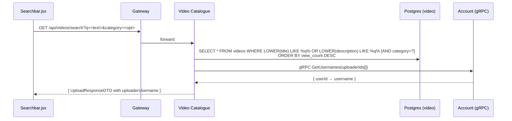

# Flow: Search

## Trigger

User types in the navbar search bar.

## Sequence

The frontend can additionally call `GET /api/profile/search?q=<text>` to surface matching channels — this happens client-side from [glense.client/src/components/SearchResults.jsx](../../glense.client/src/components/SearchResults.jsx).

## Code refs

- `VideosController.Search` in [VideosController.cs](../../services/Glense.VideoCatalogue/Controllers/VideosController.cs)
- gRPC client: [services/Glense.VideoCatalogue/GrpcClients/](../../services/Glense.VideoCatalogue/GrpcClients)
- Profile search: `ProfileController.SearchUsers` in [ProfileController.cs](../../services/Glense.AccountService/Controllers/ProfileController.cs)

## Notes

- Empty `q` returns `[]` immediately.
- Filtering is DB-level (`WHERE`) — no in-memory scans.
- gRPC failure is swallowed — usernames default to `null`.

## Related APIs

- [`GET /api/videos/search`](../api/video-catalogue.md)
- [`GET /api/profile/search`](../api/account.md)
