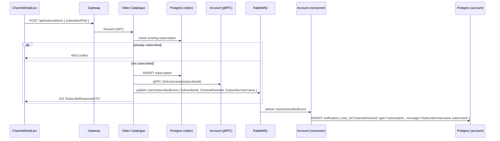

# Flow: Subscription & notification

## Trigger

User clicks Subscribe on a channel page.

## Sequence

## Code refs

- Producer: [SubscriptionsController.cs](../../services/Glense.VideoCatalogue/Controllers/SubscriptionsController.cs) (`Subscribe`)
- Event: [services/Glense.VideoCatalogue/Messages/UserSubscribedEvent.cs](../../services/Glense.VideoCatalogue/Messages/UserSubscribedEvent.cs)
- Consumer: [services/Glense.AccountService/Consumers/UserSubscribedEventConsumer.cs](../../services/Glense.AccountService/Consumers/UserSubscribedEventConsumer.cs)

## Failure modes

| Failure | Behavior |
|---------|----------|
| RabbitMQ down at publish-time | Subscription still recorded; warning logged. The notification is **lost** in this corner case (no outbox). |
| Account consumer down | Event waits in queue, picked up on recovery. |
| gRPC username lookup fails | `SubscriberUsername` defaults to `"Someone"`. |

## Related APIs

- [`POST /api/subscriptions`](../api/video-catalogue.md)
- [`GET /api/notification`](../api/account.md)
