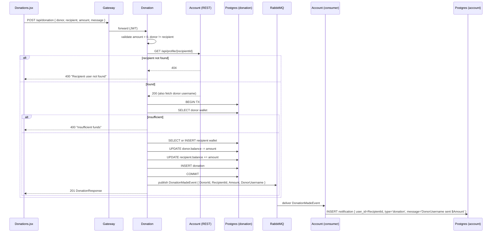

# Flow: Donation

## Trigger

`POST /api/donation { donorUserId, recipientUserId, amount, message }` (JWT required).

## Sequence

## Code refs

- Controller: [DonationController.cs](../../Glense.Server/DonationService/Controllers/DonationController.cs) (`CreateDonation`)
- Recipient lookup: `IAccountServiceClient` in [Glense.Server/DonationService/Services/](../../Glense.Server/DonationService/Services)
- Event: [Glense.Server/DonationService/Messages/DonationMadeEvent.cs](../../Glense.Server/DonationService/Messages/DonationMadeEvent.cs)
- Consumer: [services/Glense.AccountService/Consumers/DonationMadeEventConsumer.cs](../../services/Glense.AccountService/Consumers/DonationMadeEventConsumer.cs)

## Failure modes

| Failure | Behavior |
|---------|----------|
| Account unreachable for recipient validation | Donation rejected (`400`); no debit happens. |
| DB error mid-transaction | Rollback (Postgres) — no partial transfer. The in-memory provider does not support transactions; tests rely on single-`SaveChanges` atomicity. |
| RabbitMQ down at publish-time | Donation succeeds; warning logged. The recipient won't get a notification (acceptable — value already transferred). |
| Recipient has no wallet | Auto-created with balance 0 and credited. |

## Related APIs

- [`POST /api/donation`](../api/donation.md)
- [`GET /api/wallet/user/{userId}`](../api/donation.md)
- [`GET /api/notification`](../api/account.md)
