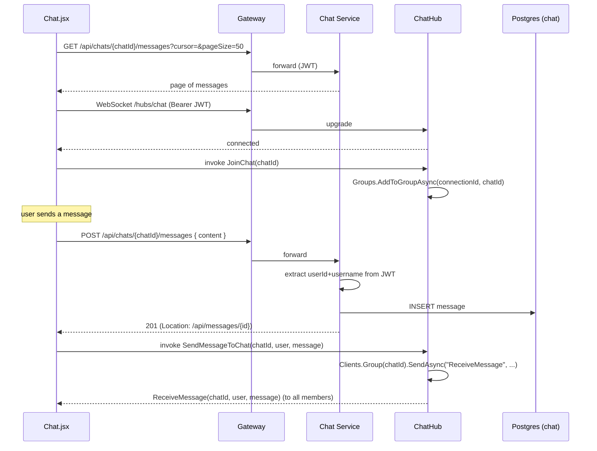

# Flow: Real-time chat

## Trigger

User opens a chat room in the SPA.

## Sequence

## Code refs

- REST: [ChatsController.cs](../../services/Glense.ChatService/Controllers/ChatsController.cs), [MessagesController.cs](../../services/Glense.ChatService/Controllers/MessagesController.cs), [MessageRootController.cs](../../services/Glense.ChatService/Controllers/MessageRootController.cs)
- Hub: [Glense.ChatService/Hubs/ChatHub.cs](../../services/Glense.ChatService/Hubs/ChatHub.cs)
- Service layer: `IChatService` in [services/Glense.ChatService/Services/](../../services/Glense.ChatService/Services)
- Frontend: [glense.client/src/components/Chat/](../../glense.client/src/components/Chat)

## Notes

- The hub is currently broadcast-only; persistence is the REST `POST` above. A future improvement is to persist inside the hub method or to fan out from the controller.
- Cursor pagination uses the message's `Id` (Guid v7-style ordering by `CreatedAtUtc`). Pass the last message's `id` as the next `cursor`.
- Chat hub negotiation must include the JWT — SignalR's `accessTokenFactory` is the standard client-side pattern.

## Related APIs

- [`GET /api/chats`](../api/chat.md)
- [`POST /api/chats/{chatId}/messages`](../api/chat.md)
- WebSocket [`/hubs/chat`](../api/chat.md)
